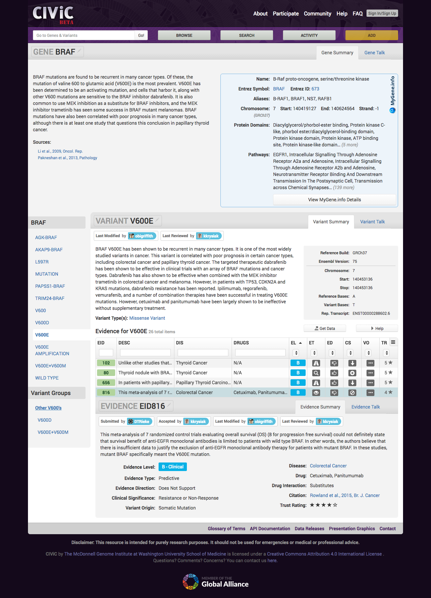
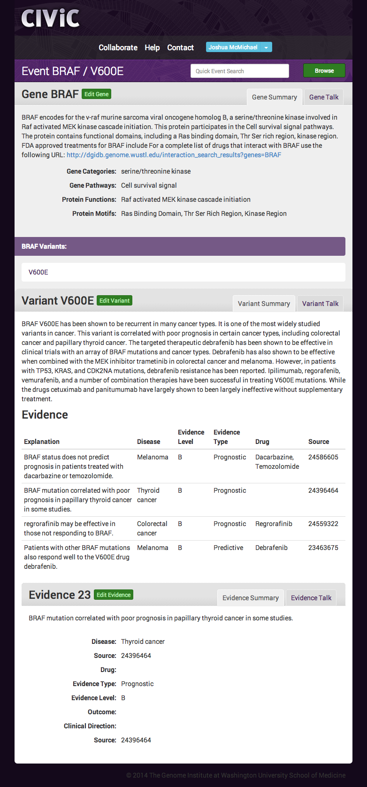

civic-client
============

## Screenshots
**Homepage:**


**Browse Events:**


**View Event:**


**Edit Gene:**


**Also looks pretty good on tablet and mobile displays:**


## Development

To start developing in the project, fire up the civic-server on port 3000 and run:

```bash
gulp serve
```

Then head to `http://localhost:3001` in your browser. 

The `serve` tasks starts a static file server, and a proxy that routes calls to /api to the civic-server listening on port 3000. It serves the AngularJS application, and a starts a watch task which watches all files for changes and lints, builds and injects them into the index.html accordingly.

## Production ready build - a.k.a. dist

To make the app ready for deploy to production run:

```bash
gulp serve:dist
```

Now there's a `./dist` folder with all scripts and stylesheets concatenated, minified, and versioned, also third party libraries installed with bower will be concatenated and minified into `vendors.min.js` and `vendors.min.css` respectively.


## Related resources
[Personalized Cancer Therapy Knowledge Base for Precision Oncology (MD Anderson Cancer Center)](https://pct.mdanderson.org/)
[My Cancer Genome - Genetically Informed Cancer Medicine (Vanderbilt-Ingram Cancer Center)](http://www.mycancergenome.org/)
[Targeted Cancer Care (Massachusetts General Hospital)](https://targetedcancercare.massgeneral.org/My-Trial-Guide/Mutations.aspx)


