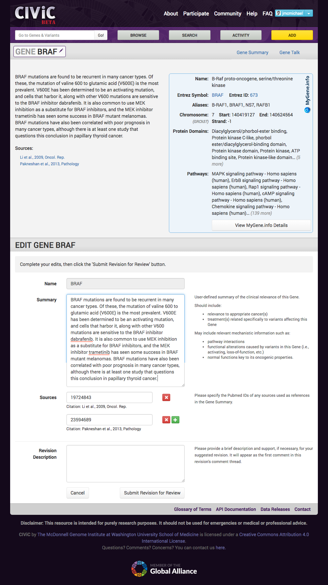

civic-client
============

## Screenshots
**Homepage:**


**Browse Events:**


**View Event:**


**Edit Gene:**


## Development

To start developing in the project, fire up the civic-server on port 3000 and run:

```bash
gulp serve
```

Then head to `http://localhost:3001` in your browser. 

The `serve` tasks starts a static file server, and a proxy that routes calls to /api to the civic-server listening on port 3000. It serves the AngularJS application, and a starts a watch task which watches all files for changes and lints, builds and injects them into the index.html accordingly.

## Tests

NOTE: There really aren't any tests yet...

To run tests run:

```bash
gulp test
```

**Or** first inject all test files into `karma.conf.js` with:

```bash
gulp karma-conf
```

Then you're able to run Karma directly. Example:

```bash
karma start --single-run
```

## Production ready build - a.k.a. dist

To make the app ready for deploy to production run:

```bash
gulp dist
```

Now there's a `./dist` folder with all scripts and stylesheets concatenated and minified, also third party libraries installed with bower will be concatenated and minified into `vendors.min.js` and `vendors.min.css` respectively.
