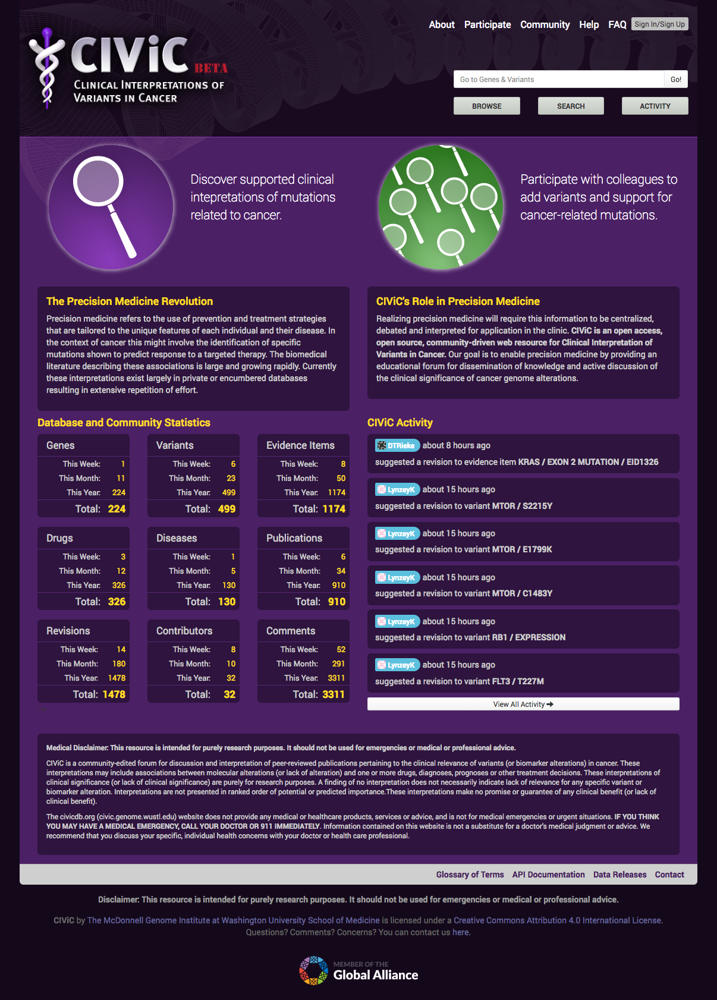

civic-client
============
[](https://gitter.im/genome/civic-client?utm_source=badge&utm_medium=badge&utm_campaign=pr-badge&utm_content=body_badge)

## Screenshots
**Homepage:**


**Browse Events:**


**View Event:**


**Edit Gene:**


**Also looks pretty good on tablet and mobile displays:**


## To Install

civic-client uses npm for development, build, and resource server tasks, so ensure that you have npm (and node) installed and running. Checkout this repository and cd to it, then:

```bash
npm install
```

Then head to Starbucks, get a coffee, read that new Pikettey book everyone's been talking about, return to your workstation and install the bower package management system:

```bash
npm install -g bower
```

and finally, use bower to install civic-client's runtime libraries:

```bash
bower install
```

If bower becomes confused about which Angular version to use, pick the first one that offers version 1.3.15.

## Development

Fire up the civic-server on port 3000 and run:

```bash
gulp serve
```

Then head to `http://127.0.0.1:3001` in your browser. *NOTE:* use `127.0.0.1`, not `localhost`. A couple of the OAuth providers we use for authentication will only work if the app is loaded from `127.0.0.1`. 

The `serve` tasks starts a static file server, and a proxy that routes calls to /api to the civic-server listening on port 3000. It serves the AngularJS application, and a starts a watch task which watches all files for changes and lints, builds and injects them into the index.html accordingly.

## Production ready build - a.k.a. dist

To make the app ready for deploy to production run:

```bash
gulp build
```

The build task creates a `./dist` folder with all scripts and stylesheets concatenated, minified, and versioned, also third party libraries installed with bower will be concatenated and minified into `vendors.min.js` and `vendors.min.css` respectively.

To test the build version of the app, execute:

```bash
gulp serve:dist
```

This task executes a build, then serves the /dist directory from the same port as the `gulp serve` task, http://127.0.0.1:3001/

## Pulling Updates
As the civic-client is under heavy development, we'll be pushing releases to the master branch at a fairly rapid rate. Often, we'll update various packages and modules that are part of the workflow and/or production codebase. So after you do a `git pull` to update your local repository, be sure to:

```bash
npm install
bower install
```

This will install any new packages or modules that the new updates require.

## Related resources
[Personalized Cancer Therapy Knowledge Base for Precision Oncology (MD Anderson Cancer Center)](https://pct.mdanderson.org/)
[My Cancer Genome - Genetically Informed Cancer Medicine (Vanderbilt-Ingram Cancer Center)](http://www.mycancergenome.org/)
[Targeted Cancer Care (Massachusetts General Hospital)](https://targetedcancercare.massgeneral.org/My-Trial-Guide/Mutations.aspx)


